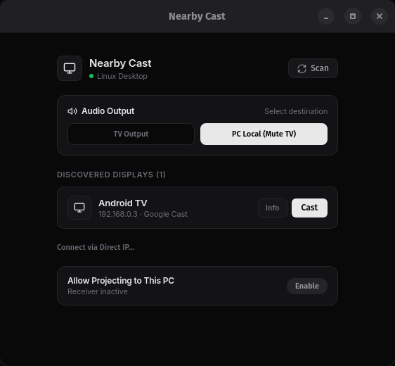
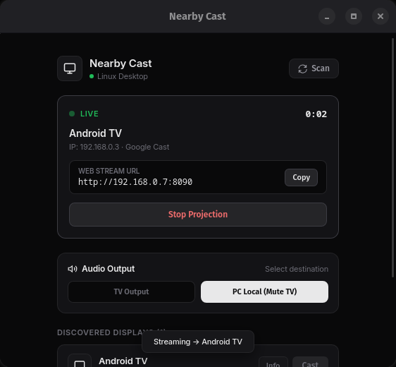

# NearbyCast

### Cast anything. Nearby. Open-source Linux desktop screen casting app.

NearbyCast is a native Linux desktop application for discovering nearby receivers and casting a selected part of your screen.

<table>
  <tr>
    <td></td>
    <td></td>
  </tr>
</table>
<p align="center">
  
  
</p>


[Download v0.1.0](https://github.com/kenan-karimli/nearby-cast/releases/tag/v0.1.0) · [Build from source](#build-from-source) · [Report an issue](https://github.com/kenan-karimli/nearby-cast/issues)

## Download

### Debian / Ubuntu

```bash
curl -fL -o NearbyCast_0.1.0_amd64.deb \
  https://github.com/kenan-karimli/nearby-cast/releases/download/v0.1.0/NearbyCast_0.1.0_amd64.deb
sudo apt install ./NearbyCast_0.1.0_amd64.deb
```

### Fedora / RHEL

```bash
curl -fLO \
  https://github.com/kenan-karimli/nearby-cast/releases/download/v0.1.0/NearbyCast-0.1.0-1.x86_64.rpm
sudo dnf install ./NearbyCast-0.1.0-1.x86_64.rpm
```

### Quick install

On supported x86_64 Linux systems:

```bash
curl -fsSL https://raw.githubusercontent.com/kenan-karimli/nearby-cast/main/install.sh | bash
```

The installer detects the distribution: Debian/Ubuntu uses `.deb`, Fedora/RHEL uses `.rpm`, and Arch or other Linux distributions use the portable `.tar.gz` release. It does not install development dependencies.

### Arch Linux and other Linux

The portable release is installed under `~/.local/share/nearby-cast` and linked as `~/.local/bin/nearby-cast`:

```bash
curl -fL -o NearbyCast-0.1.0-x86_64-portable.tar.gz \
  https://github.com/kenan-karimli/nearby-cast/releases/download/v0.1.0/NearbyCast-0.1.0-x86_64-portable.tar.gz
mkdir -p ~/.local/share/nearby-cast ~/.local/bin
tar -xzf NearbyCast-0.1.0-x86_64-portable.tar.gz -C ~/.local/share
ln -sfn ~/.local/share/nearby-cast-0.1.0-x86_64/nearby-cast ~/.local/bin/nearby-cast
```

Ensure `~/.local/bin` is on `PATH` before running `nearby-cast`.

## Features

- Discover receivers on the local network.
- Capture a full display, selected window, or selected region.
- Use the receiver’s supported casting path instead of assuming one protocol fits all devices.
- Native Tauri desktop application for Linux.

## Compatibility

| Protocol | Status |
| --- | --- |
| Google Cast | Sender path and virtual receiver verified; physical hardware is receiver-dependent and was not retested for this release. |
| NearbyCast | Authenticated sender/receiver path verified with virtual receivers. |
| Miracast | Lab sender/receiver path verified; physical Wi-Fi Direct is unverified. |
| AirPlay | Lab sender/receiver path verified; FairPlay Apple TV support is unverified. |
| OneScreen | Physical playback is unverified; do not assume compatibility. |

Screen capture is verified for supported Wayland environments using the available capture tools. X11 capture and other desktop-specific portal behavior are not release claims.

## Requirements

For Google Cast screen capture, the host needs `wf-recorder`, FFmpeg, Python 3, and `pychromecast`. Receivers and the sender must be on the same LAN.

## Use

1. Start NearbyCast.
2. Select a discovered receiver.
3. Choose Full Screen, Window, or Region.
4. Start casting and stop the session when finished.

## Build from source

```bash
git clone https://github.com/kenan-karimli/nearby-cast.git
cd nearby-cast
npm ci
npm run tauri dev
```

Production builds:

```bash
npm run build
cargo build --release --manifest-path src-tauri/Cargo.toml
npm run tauri build
```

The Tauri build writes verified Linux packages under `src-tauri/target/release/bundle/`. The current release publishes `.deb` and `.rpm`; AppImage, Flatpak, and Snap are not advertised as release downloads because they were not verified in this release audit.

Tests:

```bash
npm test
cargo test --manifest-path src-tauri/Cargo.toml
npm run test:all
```

The virtual receiver suite does not replace testing with physical receivers.

## How it works

NearbyCast discovers compatible receivers, selects an available protocol, captures the selected source, encodes the video, and streams it to the receiver.

## License

MIT. See [LICENSE](LICENSE).
